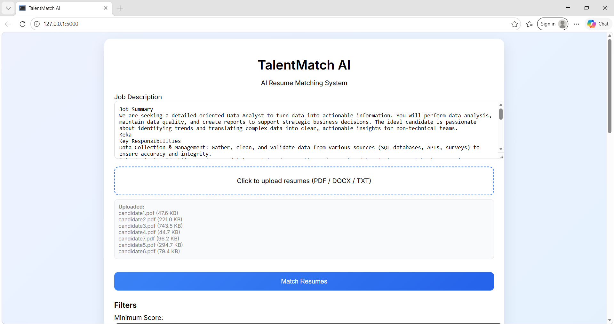
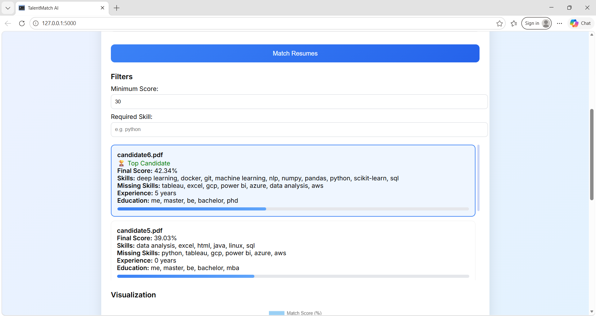
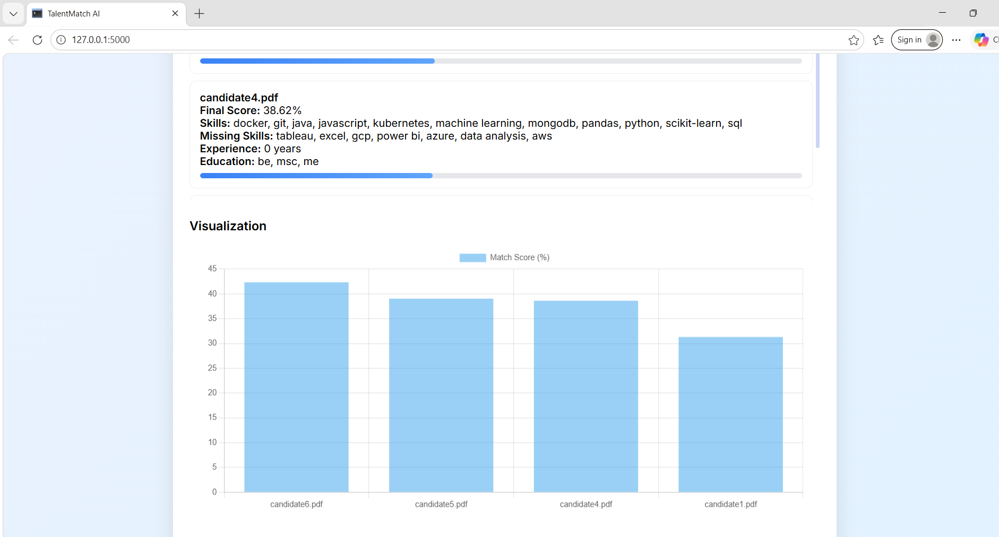
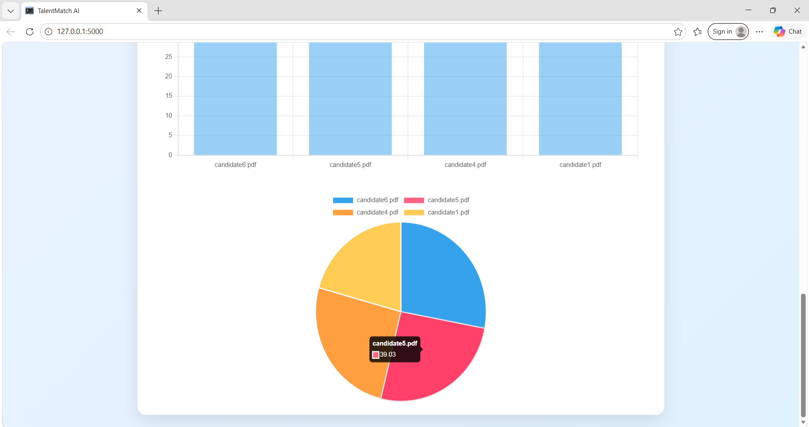

# TalentMatch AI – Intelligent Resume Screening System

An AI-powered resume matching system that analyzes resumes against job descriptions using **NLP + Machine Learning + Semantic Similarity** to rank candidates efficiently.

---

## Features

* Upload multiple resumes (PDF, DOCX, TXT)
* Semantic Matching using Sentence Transformers (BERT)
* Hybrid Scoring (Semantic + TF-IDF + Skills)
* Skill Extraction with Synonym Matching
* Resume Ranking based on job relevance
* Visualization (Bar Chart + Pie Chart)
* Filters (Minimum Score, Skill-based)
* Top Candidate Highlighting
* Fast & Interactive UI

---

## Tech Stack

### Backend

* Python
* Flask
* Sentence Transformers (BERT)
* Scikit-learn (TF-IDF, Cosine Similarity)

### Frontend

* HTML, CSS, JavaScript
* Chart.js

### NLP / Processing

* Regex-based parsing
* Skill extraction engine
* Resume preprocessing

---

## Screenshots

### Home UI



### Upload Section



### Results & Ranking



### Visualization



---

## Installation & Setup

### Clone Repository

```bash
git clone https://github.com/Saumya-eng/talentmatch-ai.git
cd talentmatch-ai
```

### Create Virtual Environment

```bash
python -m venv rag_env
rag_env\Scripts\activate  # Windows
```

### Install Dependencies

```bash
pip install -r requirements.txt
```

### Run Application

```bash
python app.py
```

### Open in Browser

```
http://127.0.0.1:5000
```

---

## Project Structure

```
TalentMatch AI/
│
├── app.py
├── requirements.txt
├── .gitignore
│
├── utils/
│   ├── parser.py
│   ├── parser_advanced.py
│   ├── preprocess.py
│   ├── matcher.py
│   ├── semantic.py
│   ├── skills.py
│
├── templates/
│   ├── index.html
│
├── static/
│   ├── css/style.css
│   ├── js/main.js
│
├── uploads/
├── screenshots/
```

---

## How It Works

1. Extract text from resumes (PDF/DOCX/TXT)
2. Clean & preprocess text
3. Extract skills, education, experience
4. Compute:

   * Semantic similarity (BERT)
   * TF-IDF similarity
   * Skill match score
5. Combine scores (Hybrid Model)
6. Rank resumes
7. Display results + charts

---

## Scoring Formula

```
Final Score =
0.5 × Semantic Score +
0.3 × Skill Match +
0.2 × TF-IDF Score
```

---

## Future Improvements

* GPT-based resume understanding
* ATS scoring system
* Deploy on cloud (Render / AWS)
* Dashboard with analytics
* Resume feedback suggestions

---

## Resume Project Description

**TalentMatch AI – Resume Screening System**
Developed an AI-based resume matching system using NLP and machine learning techniques. Implemented semantic similarity (BERT), TF-IDF, and skill-based scoring to rank candidates. Built an interactive web app using Flask and Chart.js with real-time filtering and visualization.

---

## Author

**Saumya Verma**
Final Year CSE (AI/ML) Student
Aspiring Software + AI Engineer

---

## If you like this project, give it a star!